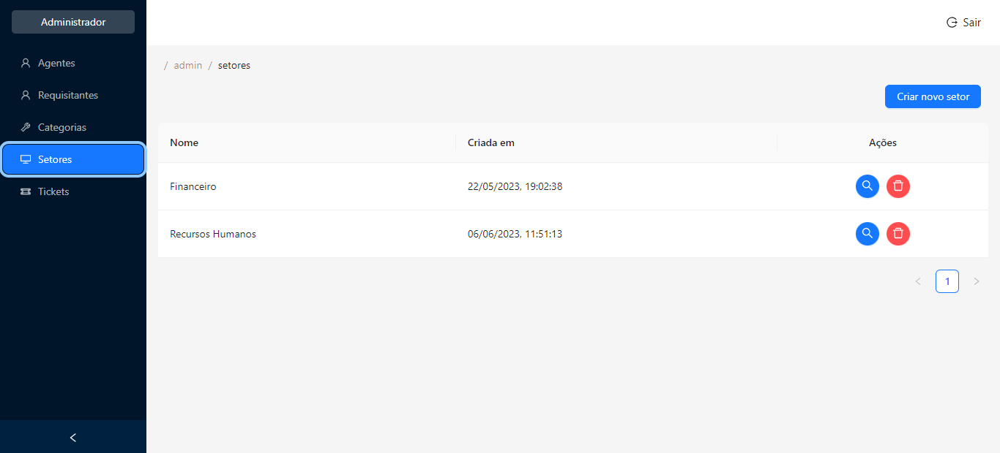

# Projeto Integrador II




> Projeto frontend para o controle de tickets, ou requisições de suporte, com opção de administrar agentes, requisitantes, setores, tickets e categorias.

### Ajustes e melhorias

O projeto ainda está em desenvolvimento e as próximas atualizações serão voltadas nas seguintes tarefas:

- [ ] Ajustar o componente de chat
- [ ] Criar a página Home

## 💻 Pré-requisitos

Antes de começar, verifique se você atendeu aos seguintes requisitos:

- Você instalou a versão mais recente do `Node.js`.

## 🚀 Instalando o pi-iii-frontend

Para instalar o pi-iii-frontend, siga estas etapas:

1. Clone este repositório em sua máquina.

2. Abra um terminal na pasta do projeto e execute o seguinte comando:

```
npm install
```

## ☕ Usando o pi-iii-frontend

Para usar o pi-iii-frontend, siga estas etapas:

1. Siga as instruções de instalação do backend, no readme deste repositório [pi-iii-backend](https://github.com/eduardo-ibarr/pi-iii-backend).

2. Mude a URL no arquivo `scripts\run_locally.cmd` na linha 4 para adicionar o caminho onde se encontra o pi-iii-backend na sua máquina.

3. Abra o terminal na pasta do pi-iii-frontend, e digite o seguinte comando:

```
npm run dev
```
